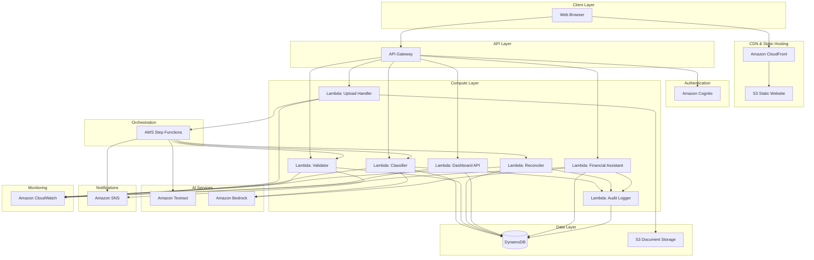
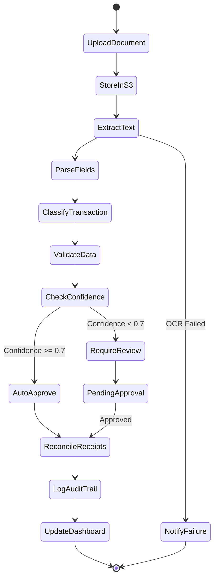

# Design Document: AI Accounting Copilot

## Overview

The AI Accounting Copilot is a serverless financial management system built on AWS infrastructure that automates bookkeeping for small and medium enterprises (SMEs). The system leverages AWS managed services to provide document capture, transaction classification, data validation, reconciliation, and conversational financial insights while maintaining complete audit trails and human oversight.

### Design Goals

1. **Serverless Architecture**: Utilize AWS managed services to minimize operational overhead and enable automatic scaling
2. **Cost Optimization**: Stay within AWS Free Tier limits where possible, with explicit identification of paid services
3. **Security First**: Implement encryption at rest and in transit, with fine-grained access controls
4. **Audit Transparency**: Maintain comprehensive logs of all AI decisions and human approvals
5. **Performance**: Meet response time requirements (OCR < 5s, classification < 2s, dashboard load < 3s)
6. **Extensibility**: Design modular components that can be enhanced or replaced independently

### High-Level Architecture

The system follows a serverless microservices architecture with the following layers:

- **Presentation Layer**: S3-hosted static website delivered via CloudFront
- **Authentication Layer**: Cognito user pools for identity management
- **API Layer**: API Gateway providing RESTful endpoints
- **Compute Layer**: Lambda functions for business logic
- **AI/ML Layer**: Textract for OCR, Bedrock for classification and conversational AI
- **Data Layer**: DynamoDB for structured data, S3 for document storage
- **Orchestration Layer**: Step Functions for multi-step workflows
- **Notification Layer**: SNS for alerts and reminders
- **Monitoring Layer**: CloudWatch for logs, metrics, and alarms


## Architecture

### System Architecture Diagram



### Document Processing Workflow



### AWS Free Tier Considerations

**Services Within Free Tier (with limits):**
- **S3**: 5 GB storage, 20,000 GET requests, 2,000 PUT requests per month (12 months)
- **CloudFront**: 1 TB data transfer out, 10,000,000 HTTP/HTTPS requests per month (12 months)
- **Lambda**: 1 million requests, 400,000 GB-seconds compute per month (always free)
- **API Gateway**: 1 million API calls per month (12 months)
- **DynamoDB**: 25 GB storage, 25 read/write capacity units (always free)
- **Cognito**: 50,000 monthly active users (always free)
- **SNS**: 1,000 email notifications per month (always free)
- **CloudWatch**: 10 custom metrics, 10 alarms, 5 GB log ingestion (always free)

**Services OUTSIDE Free Tier (Paid Services):**
- **Amazon Textract**: $1.50 per 1,000 pages for Detect Document Text API
  - *Estimated cost*: For 100 receipts/month = ~$0.15/month
- **Amazon Bedrock**: Pricing varies by model
  - *Claude 3 Haiku*: $0.25 per 1M input tokens, $1.25 per 1M output tokens
  - *Estimated cost*: For 500 classifications + 100 assistant queries/month = ~$2-5/month
- **AWS Step Functions**: $25 per 1 million state transitions
  - *Estimated cost*: For 100 workflows/month = ~$0.01/month

**Total Estimated Monthly Cost**: $2-6/month for typical SME usage (100-200 documents/month)


## Components and Interfaces

### Frontend Components

#### Dashboard Application (S3 + CloudFront)
- **Technology**: React SPA hosted on S3, delivered via CloudFront
- **Responsibilities**:
  - Display financial summaries and charts
  - Upload document images
  - Review and approve flagged transactions
  - Interact with financial assistant chatbot
  - View audit trail
- **Key Features**:
  - Responsive design for mobile and desktop
  - Real-time updates via API polling
  - Client-side caching for performance
  - Secure token-based authentication

### Authentication Component

#### Amazon Cognito User Pool
- **Configuration**:
  - Email-based authentication
  - Password policy: minimum 8 characters, uppercase, lowercase, number, special character
  - MFA optional (recommended for production)
  - Session timeout: 15 minutes of inactivity
- **Token Management**:
  - JWT tokens with 1-hour expiration
  - Refresh tokens valid for 30 days
  - Automatic token refresh on API calls

### API Layer

#### API Gateway REST API
- **Endpoints**:

```
POST   /documents/upload          - Upload financial document
GET    /documents/{id}             - Retrieve document details
GET    /documents                  - List documents with pagination

POST   /transactions               - Create transaction manually
GET    /transactions/{id}          - Retrieve transaction details
GET    /transactions               - List transactions with filters
PUT    /transactions/{id}          - Update transaction
DELETE /transactions/{id}          - Delete transaction

POST   /transactions/{id}/approve  - Approve flagged transaction
POST   /transactions/{id}/correct  - Correct classification

GET    /dashboard/summary          - Get dashboard data
GET    /dashboard/trends           - Get trend analysis

POST   /assistant/query            - Ask financial question
GET    /assistant/history          - Get conversation history

GET    /audit-trail                - Get audit log entries
GET    /audit-trail/export         - Export audit trail as CSV

GET    /reconciliation/pending     - Get unmatched transactions
POST   /reconciliation/match       - Manually match receipt to transaction

GET    /approvals/pending          - Get pending approvals
POST   /approvals/{id}/approve     - Approve pending item
POST   /approvals/{id}/reject      - Reject pending item
```

- **Authentication**: All endpoints require valid Cognito JWT token
- **Rate Limiting**: 100 requests per minute per user
- **CORS**: Configured for CloudFront domain only

### Lambda Functions

#### 1. Document Upload Handler
- **Trigger**: API Gateway POST /documents/upload
- **Runtime**: Python 3.11
- **Memory**: 512 MB
- **Timeout**: 30 seconds
- **Responsibilities**:
  - Validate uploaded file (type, size < 10 MB)
  - Generate unique document ID
  - Upload to S3 with encryption
  - Initiate Step Functions workflow
  - Return document ID to client
- **Environment Variables**:
  - `DOCUMENTS_BUCKET`: S3 bucket name
  - `WORKFLOW_ARN`: Step Functions state machine ARN

#### 2. OCR Processor (Step Functions Task)
- **Runtime**: Python 3.11
- **Memory**: 1024 MB
- **Timeout**: 60 seconds
- **Responsibilities**:
  - Call Textract DetectDocumentText API
  - Parse Textract response
  - Extract structured fields (date, amount, vendor, line items)
  - Handle OCR failures gracefully
- **Integration**: Amazon Textract

#### 3. Transaction Classifier
- **Trigger**: Step Functions workflow / API Gateway
- **Runtime**: Python 3.11
- **Memory**: 512 MB
- **Timeout**: 10 seconds
- **Responsibilities**:
  - Call Bedrock with transaction details
  - Parse classification response
  - Calculate confidence score
  - Store classification in DynamoDB
  - Log decision to audit trail
- **Bedrock Model**: Claude 3 Haiku (cost-effective, fast)
- **Prompt Template**:
```
Classify the following transaction into one of these categories:
[list of categories]

Transaction details:
- Date: {date}
- Amount: {amount}
- Vendor: {vendor}
- Description: {description}

Respond with JSON:
{
  "category": "category_name",
  "confidence": 0.0-1.0,
  "reasoning": "explanation"
}
```

#### 4. Data Validator
- **Trigger**: Step Functions workflow
- **Runtime**: Python 3.11
- **Memory**: 512 MB
- **Timeout**: 10 seconds
- **Responsibilities**:
  - Check for duplicate transactions (same amount, date, vendor within 24 hours)
  - Detect outliers (> 3 standard deviations from category average)
  - Identify missing sequential invoice numbers
  - Flag transactions for review if issues found
  - Send SNS notifications for critical issues
- **DynamoDB Queries**:
  - Query by date range and amount range
  - Calculate category statistics

#### 5. Reconciliation Engine
- **Trigger**: Step Functions workflow / Scheduled (daily)
- **Runtime**: Python 3.11
- **Memory**: 512 MB
- **Timeout**: 60 seconds
- **Responsibilities**:
  - Match receipts to bank transactions
  - Use fuzzy matching on amount (±5%), date (±3 days), vendor name
  - Calculate match confidence score
  - Auto-link high confidence matches (> 0.8)
  - Flag medium confidence matches (0.5-0.8) for review
  - Identify unmatched transactions > 7 days old
  - Send SNS notifications for unmatched items
- **Matching Algorithm**:
  - Amount similarity: 40% weight
  - Date proximity: 30% weight
  - Vendor name similarity (Levenshtein distance): 30% weight

#### 6. Dashboard API
- **Trigger**: API Gateway GET /dashboard/*
- **Runtime**: Python 3.11
- **Memory**: 256 MB
- **Timeout**: 5 seconds
- **Responsibilities**:
  - Query DynamoDB for transaction summaries
  - Calculate current cash balance
  - Aggregate income and expenses by month
  - Generate trend data for charts
  - Return top expense categories
- **Caching**: API Gateway cache enabled (5 minutes TTL)
- **DynamoDB Access Patterns**:
  - Query by user_id and date range
  - GSI on category for aggregations

#### 7. Financial Assistant
- **Trigger**: API Gateway POST /assistant/query
- **Runtime**: Python 3.11
- **Memory**: 1024 MB
- **Timeout**: 30 seconds
- **Responsibilities**:
  - Parse user question
  - Query relevant transaction data from DynamoDB
  - Call Bedrock with context and question
  - Format response with citations
  - Store conversation in DynamoDB
  - Log interaction to audit trail
- **Bedrock Model**: Claude 3 Haiku
- **Context Window**: Last 10 conversation turns + relevant transactions
- **Prompt Template**:
```
You are a financial assistant for an SME owner. Answer questions about their business finances using the provided transaction data.

Transaction data:
{transaction_summary}

Conversation history:
{conversation_history}

User question: {question}

Provide a clear answer in plain language. Cite specific transactions or data points as evidence. If you don't have enough data, explain what's missing.
```

#### 8. Audit Logger
- **Trigger**: Called by other Lambda functions
- **Runtime**: Python 3.11
- **Memory**: 256 MB
- **Timeout**: 5 seconds
- **Responsibilities**:
  - Write audit trail entries to DynamoDB
  - Include timestamp, action type, actor (AI/human), details, confidence scores
  - Support batch writes for performance
- **DynamoDB Schema**: See Data Models section

### Step Functions Workflow

#### Document Processing State Machine

```json
{
  "Comment": "Process uploaded financial document",
  "StartAt": "ExtractText",
  "States": {
    "ExtractText": {
      "Type": "Task",
      "Resource": "arn:aws:lambda:REGION:ACCOUNT:function:OCRProcessor",
      "Catch": [{
        "ErrorEquals": ["OCRFailure"],
        "Next": "NotifyOCRFailure"
      }],
      "Next": "ClassifyTransaction"
    },
    "ClassifyTransaction": {
      "Type": "Task",
      "Resource": "arn:aws:lambda:REGION:ACCOUNT:function:TransactionClassifier",
      "Next": "ValidateData"
    },
    "ValidateData": {
      "Type": "Task",
      "Resource": "arn:aws:lambda:REGION:ACCOUNT:function:DataValidator",
      "Next": "CheckConfidence"
    },
    "CheckConfidence": {
      "Type": "Choice",
      "Choices": [{
        "Variable": "$.confidence",
        "NumericGreaterThanEquals": 0.7,
        "Next": "ReconcileReceipts"
      }],
      "Default": "FlagForReview"
    },
    "FlagForReview": {
      "Type": "Task",
      "Resource": "arn:aws:lambda:REGION:ACCOUNT:function:FlagTransaction",
      "Next": "NotifyPendingApproval"
    },
    "NotifyPendingApproval": {
      "Type": "Task",
      "Resource": "arn:aws:states:::sns:publish",
      "Parameters": {
        "TopicArn": "arn:aws:sns:REGION:ACCOUNT:pending-approvals",
        "Message.$": "$.message"
      },
      "Next": "ReconcileReceipts"
    },
    "ReconcileReceipts": {
      "Type": "Task",
      "Resource": "arn:aws:lambda:REGION:ACCOUNT:function:ReconciliationEngine",
      "Next": "LogAuditTrail"
    },
    "LogAuditTrail": {
      "Type": "Task",
      "Resource": "arn:aws:lambda:REGION:ACCOUNT:function:AuditLogger",
      "End": true
    },
    "NotifyOCRFailure": {
      "Type": "Task",
      "Resource": "arn:aws:states:::sns:publish",
      "Parameters": {
        "TopicArn": "arn:aws:sns:REGION:ACCOUNT:ocr-failures",
        "Message": "OCR processing failed. Manual entry required."
      },
      "End": true
    }
  }
}
```

### Notification Service

#### Amazon SNS Topics

1. **pending-approvals**: Notifications for transactions requiring review
2. **ocr-failures**: Alerts when document processing fails
3. **unmatched-transactions**: Daily digest of unreconciled items
4. **approval-reminders**: Reminders for approvals pending > 48 hours

**Subscription Protocol**: Email (within free tier: 1,000 emails/month)

### Monitoring and Logging

#### CloudWatch Configuration

**Log Groups**:
- `/aws/lambda/DocumentUploadHandler`
- `/aws/lambda/OCRProcessor`
- `/aws/lambda/TransactionClassifier`
- `/aws/lambda/DataValidator`
- `/aws/lambda/ReconciliationEngine`
- `/aws/lambda/DashboardAPI`
- `/aws/lambda/FinancialAssistant`
- `/aws/lambda/AuditLogger`

**Metrics**:
- Document processing duration
- Classification accuracy (approved vs corrected)
- API response times
- Error rates by function
- DynamoDB read/write capacity usage

**Alarms**:
- Lambda error rate > 5%
- API Gateway 5xx errors > 10 per minute
- DynamoDB throttling events
- S3 bucket size approaching free tier limit


## Data Models

### DynamoDB Table Design

The system uses a single-table design pattern for optimal performance and cost efficiency within DynamoDB free tier limits.

#### Primary Table: `AccountingCopilot`

**Partition Key (PK)**: String  
**Sort Key (SK)**: String  
**Attributes**: Various (see entity types below)

**Global Secondary Indexes**:
1. **GSI1**: `GSI1PK` (partition), `GSI1SK` (sort) - For querying by category and date
2. **GSI2**: `GSI2PK` (partition), `GSI2SK` (sort) - For querying pending approvals

#### Entity Types

##### 1. User Profile
```json
{
  "PK": "USER#<user_id>",
  "SK": "PROFILE",
  "entity_type": "user_profile",
  "email": "user@example.com",
  "business_name": "Example SME",
  "created_at": "2024-01-15T10:30:00Z",
  "custom_categories": ["Office Supplies", "Marketing", "Utilities"],
  "notification_preferences": {
    "email": true,
    "approval_reminders": true
  }
}
```

##### 2. Financial Document
```json
{
  "PK": "USER#<user_id>",
  "SK": "DOC#<document_id>",
  "entity_type": "document",
  "document_id": "doc_abc123",
  "s3_key": "documents/user123/doc_abc123.jpg",
  "s3_bucket": "accounting-copilot-documents",
  "upload_timestamp": "2024-01-15T10:30:00Z",
  "document_type": "receipt",
  "ocr_status": "completed",
  "extracted_text": "...",
  "parsed_fields": {
    "date": "2024-01-15",
    "amount": 45.99,
    "currency": "USD",
    "vendor": "Office Depot",
    "line_items": [
      {"description": "Paper", "amount": 25.99},
      {"description": "Pens", "amount": 20.00}
    ]
  },
  "processing_duration_ms": 3450
}
```

##### 3. Transaction
```json
{
  "PK": "USER#<user_id>",
  "SK": "TXN#<transaction_id>",
  "GSI1PK": "USER#<user_id>#CAT#<category>",
  "GSI1SK": "DATE#<date>",
  "GSI2PK": "USER#<user_id>#STATUS#pending",
  "GSI2SK": "DATE#<date>",
  "entity_type": "transaction",
  "transaction_id": "txn_xyz789",
  "date": "2024-01-15",
  "amount": 45.99,
  "currency": "USD",
  "type": "expense",
  "category": "Office Supplies",
  "vendor": "Office Depot",
  "description": "Office supplies purchase",
  "classification_confidence": 0.92,
  "classification_reasoning": "Vendor name and line items indicate office supplies",
  "status": "approved",
  "flagged_for_review": false,
  "validation_issues": [],
  "source": "receipt",
  "document_id": "doc_abc123",
  "reconciliation_status": "matched",
  "matched_bank_transaction_id": "bank_txn_456",
  "created_at": "2024-01-15T10:35:00Z",
  "updated_at": "2024-01-15T10:35:00Z",
  "created_by": "ai",
  "approved_by": "user",
  "approved_at": "2024-01-15T11:00:00Z"
}
```

##### 4. Bank Transaction
```json
{
  "PK": "USER#<user_id>",
  "SK": "BANK#<bank_transaction_id>",
  "entity_type": "bank_transaction",
  "bank_transaction_id": "bank_txn_456",
  "date": "2024-01-15",
  "amount": 45.99,
  "currency": "USD",
  "description": "OFFICE DEPOT #1234",
  "reconciliation_status": "matched",
  "matched_transaction_id": "txn_xyz789",
  "match_confidence": 0.95,
  "imported_at": "2024-01-16T08:00:00Z"
}
```

##### 5. Audit Trail Entry
```json
{
  "PK": "USER#<user_id>",
  "SK": "AUDIT#<timestamp>#<action_id>",
  "entity_type": "audit_entry",
  "action_id": "audit_001",
  "timestamp": "2024-01-15T10:35:00Z",
  "action_type": "classification",
  "actor": "ai",
  "actor_details": "bedrock:claude-3-haiku",
  "subject_type": "transaction",
  "subject_id": "txn_xyz789",
  "action_details": {
    "category": "Office Supplies",
    "confidence": 0.92,
    "reasoning": "Vendor name and line items indicate office supplies"
  },
  "result": "success"
}
```

##### 6. Pending Approval
```json
{
  "PK": "USER#<user_id>",
  "SK": "APPROVAL#<approval_id>",
  "GSI2PK": "USER#<user_id>#STATUS#pending",
  "GSI2SK": "DATE#<created_at>",
  "entity_type": "pending_approval",
  "approval_id": "approval_123",
  "approval_type": "new_vendor",
  "subject_type": "transaction",
  "subject_id": "txn_xyz789",
  "created_at": "2024-01-15T10:35:00Z",
  "reminder_sent_at": null,
  "status": "pending",
  "details": {
    "vendor_name": "New Vendor Inc",
    "amount": 1250.00,
    "reason": "Exceeds 10% of average monthly expenses"
  }
}
```

##### 7. Conversation History
```json
{
  "PK": "USER#<user_id>",
  "SK": "CONV#<conversation_id>#MSG#<message_id>",
  "entity_type": "conversation_message",
  "conversation_id": "conv_abc",
  "message_id": "msg_001",
  "timestamp": "2024-01-15T14:30:00Z",
  "role": "user",
  "content": "Can I afford to hire a new employee?",
  "response": {
    "content": "Based on your current cash flow...",
    "citations": ["txn_xyz789", "txn_abc123"],
    "confidence": 0.85
  }
}
```

##### 8. Category Statistics (for validation)
```json
{
  "PK": "USER#<user_id>",
  "SK": "STATS#<category>#<month>",
  "entity_type": "category_stats",
  "category": "Office Supplies",
  "month": "2024-01",
  "transaction_count": 15,
  "total_amount": 450.00,
  "average_amount": 30.00,
  "std_deviation": 12.50,
  "min_amount": 10.00,
  "max_amount": 75.00,
  "updated_at": "2024-01-15T23:59:59Z"
}
```

### S3 Bucket Structure

#### Documents Bucket: `accounting-copilot-documents-{account-id}`

**Folder Structure**:
```
documents/
  {user_id}/
    receipts/
      {year}/
        {month}/
          {document_id}.{ext}
    invoices/
      {year}/
        {month}/
          {document_id}.{ext}
    bank_statements/
      {year}/
        {month}/
          {document_id}.pdf
```

**Encryption**: AES-256 (SSE-S3)  
**Lifecycle Policy**: 
- Transition to S3 Glacier after 1 year
- Retain for 7 years (compliance requirement)

**Access Control**:
- Bucket policy restricts access to Lambda execution roles only
- Pre-signed URLs for client uploads (15-minute expiration)
- Pre-signed URLs for client downloads (5-minute expiration)

#### Static Website Bucket: `accounting-copilot-web-{account-id}`

**Contents**:
- index.html
- static/css/
- static/js/
- static/images/
- favicon.ico

**CloudFront Configuration**:
- Origin: S3 bucket
- Default root object: index.html
- Custom error responses: 404 → /index.html (for SPA routing)
- SSL/TLS certificate: CloudFront default or custom ACM certificate
- Caching: 1 hour for static assets, no cache for index.html


## Correctness Properties

*A property is a characteristic or behavior that should hold true across all valid executions of a system—essentially, a formal statement about what the system should do. Properties serve as the bridge between human-readable specifications and machine-verifiable correctness guarantees.*

### Property Reflection

After analyzing all acceptance criteria, I identified the following redundancies and consolidations:

**Consolidations:**
- Properties 2.6, 4.6, 6.6, 7.1, 7.2, 7.3, and 10.6 all relate to audit trail logging for different action types. These can be consolidated into a single comprehensive property about audit trail completeness.
- Properties 3.2, 3.6, 4.5 all relate to notifications being sent when issues are detected. These can be consolidated into a general notification property.
- Properties 5.2 and 5.3 (income and expense totals) are similar aggregation operations and can be combined into a single property about transaction aggregation.
- Properties 7.1, 7.2, 7.3 are subsumed by the general audit trail property and don't need separate entries.

**Redundancies Eliminated:**
- Property 4.1 (search for matches) is implied by properties 4.2 and 4.3 (which test the matching behavior), so 4.1 is redundant.
- Property 8.4 (display pending approvals count) is a simple count operation that's validated by the underlying data being correct, which is covered by other properties.

After reflection, the following properties provide unique validation value:

### Property 1: Document Parsing Produces Structured Fields

*For any* valid extracted text from a financial document, the parser should successfully produce a structured object containing date, amount, vendor, and line items fields.

**Validates: Requirements 1.2**

### Property 2: Document Storage Round-Trip

*For any* financial document processed by the system, storing the document should allow retrieval of both the original image and the extracted data, and they should match the original inputs.

**Validates: Requirements 1.5**

### Property 3: OCR Failure Notification

*For any* document where OCR extraction fails, the system should generate a notification to the user requesting manual entry.

**Validates: Requirements 1.4**

### Property 4: Classification Confidence Score Validity

*For any* transaction classification, the confidence score should be a valid number between 0 and 1 (inclusive).

**Validates: Requirements 2.2**

### Property 5: Low Confidence Flagging

*For any* transaction with a classification confidence score below 0.7, the transaction should be flagged for SME owner review.

**Validates: Requirements 2.3**

### Property 6: Custom Category Support

*For any* custom category defined by a user, the system should be able to classify transactions into that category and return it as a valid classification result.

**Validates: Requirements 2.5**

### Property 7: Duplicate Detection

*For any* transaction, if another transaction exists with the same amount, vendor, and date within 24 hours, the system should detect it as a duplicate.

**Validates: Requirements 3.1**

### Property 8: Outlier Detection

*For any* transaction in a category with at least 10 historical transactions, if the amount exceeds 3 standard deviations from the category average, the system should detect it as an outlier.

**Validates: Requirements 3.3, 3.4**

### Property 9: Sequential Invoice Gap Detection

*For any* sequence of invoice numbers from the same vendor, the system should identify any missing numbers in the sequence.

**Validates: Requirements 3.5**

### Property 10: Issue Notification

*For any* detected issue (duplicate, outlier, missing invoice, unmatched transaction), the system should generate an appropriate notification to the user.

**Validates: Requirements 3.2, 3.6, 4.5**

### Property 11: High Confidence Auto-Matching

*For any* bank transaction and receipt pair with a match confidence score above 0.8, the system should automatically link them without requiring approval.

**Validates: Requirements 4.2**

### Property 12: Medium Confidence Approval Requirement

*For any* bank transaction and receipt pair with a match confidence score between 0.5 and 0.8 (inclusive), the system should flag the match for SME owner approval rather than auto-linking.

**Validates: Requirements 4.3**

### Property 13: Unmatched Transaction Identification

*For any* bank transaction that remains unmatched for more than 7 days, the system should identify it as requiring attention.

**Validates: Requirements 4.4**

### Property 14: Transaction Aggregation Accuracy

*For any* set of transactions within a given time period, the system should correctly calculate the sum of all income transactions and the sum of all expense transactions for that period.

**Validates: Requirements 5.2, 5.3**

### Property 15: Profit Trend Calculation

*For any* transaction history spanning at least 6 months, the system should calculate monthly profit (income minus expenses) for each of the last 6 months.

**Validates: Requirements 5.4**

### Property 16: Top Categories Ranking

*For any* set of expense transactions in a given month, the system should correctly identify and rank the top 5 expense categories by total amount in descending order.

**Validates: Requirements 5.5**

### Property 17: Assistant Response Citations

*For any* answer provided by the financial assistant, the response should include citations to specific transactions or data points that support the answer.

**Validates: Requirements 6.3**

### Property 18: Insufficient Data Explanation

*For any* question that cannot be answered due to missing data, the financial assistant should provide a response explaining what specific data is missing.

**Validates: Requirements 6.4**

### Property 19: Comprehensive Audit Trail

*For any* AI action (classification, reconciliation, assistant query) or human action (approval, correction), the system should create an audit trail entry containing the action type, timestamp, actor, subject, and relevant details (confidence scores, reasoning, etc.).

**Validates: Requirements 2.6, 4.6, 6.6, 7.1, 7.2, 7.3, 10.6**

### Property 20: Audit Trail Filtering

*For any* filter criteria (date range, action type, or transaction ID), the audit trail query should return only entries that match all specified criteria.

**Validates: Requirements 7.4**

### Property 21: Audit Trail CSV Export

*For any* set of audit trail entries, exporting to CSV should produce a valid CSV file where parsing the CSV reproduces the original audit data.

**Validates: Requirements 7.6**

### Property 22: Large Transaction Approval Requirement

*For any* transaction with an amount exceeding 10% of the user's average monthly expenses, the system should require SME owner approval before recording the transaction.

**Validates: Requirements 8.1**

### Property 23: New Vendor Approval Requirement

*For any* transaction with a vendor that does not exist in the user's vendor list, the system should require SME owner approval before creating the vendor record.

**Validates: Requirements 8.2**

### Property 24: Bulk Reclassification Approval

*For any* operation that would reclassify 2 or more historical transactions, the system should require SME owner approval before applying the changes.

**Validates: Requirements 8.3**

### Property 25: Approval Reminder Timing

*For any* pending approval that remains unapproved for more than 48 hours, the system should send a reminder notification to the user.

**Validates: Requirements 8.5**

### Property 26: Document Parsing Round-Trip

*For any* valid financial document object, parsing it to structured format, then printing it to text, then parsing again should produce an equivalent object.

**Validates: Requirements 9.4**

### Property 27: Parser Error Handling

*For any* invalid financial document (missing required fields or malformed data), the parser should return a descriptive error message rather than crashing or producing invalid output.

**Validates: Requirements 9.2**

### Property 28: Required Field Validation

*For any* financial document, the parser should reject it with an error if any required fields (date, amount, type) are missing.

**Validates: Requirements 9.5**

### Property 29: Authentication Requirement

*For any* API endpoint that returns financial data, the system should reject requests that do not include a valid authentication token.

**Validates: Requirements 10.4**

### Property 30: Session Timeout

*For any* user session that has been inactive for 15 minutes or more, the system should automatically invalidate the session and require re-authentication.

**Validates: Requirements 10.5**


## Error Handling

### Error Categories

#### 1. Client Errors (4xx)

**400 Bad Request**
- Invalid request payload
- Missing required fields
- Invalid field formats (e.g., invalid date, negative amount)
- File size exceeds 10 MB limit
- Unsupported file type

**401 Unauthorized**
- Missing authentication token
- Expired authentication token
- Invalid authentication token

**403 Forbidden**
- User attempting to access another user's data
- Insufficient permissions for requested operation

**404 Not Found**
- Requested resource (document, transaction, etc.) does not exist
- Invalid endpoint

**409 Conflict**
- Duplicate transaction detected
- Attempting to approve already-approved item

**429 Too Many Requests**
- Rate limit exceeded (100 requests/minute)

#### 2. Server Errors (5xx)

**500 Internal Server Error**
- Unhandled Lambda exception
- DynamoDB operation failure
- Unexpected error in business logic

**502 Bad Gateway**
- Textract API failure
- Bedrock API failure
- Downstream service unavailable

**503 Service Unavailable**
- DynamoDB throttling
- Lambda concurrent execution limit reached
- Temporary service degradation

**504 Gateway Timeout**
- Lambda function timeout (exceeded configured timeout)
- Textract processing timeout
- Bedrock response timeout

### Error Response Format

All API errors return a consistent JSON structure:

```json
{
  "error": {
    "code": "ERROR_CODE",
    "message": "Human-readable error message",
    "details": {
      "field": "specific_field",
      "reason": "detailed explanation"
    },
    "request_id": "req_abc123",
    "timestamp": "2024-01-15T10:30:00Z"
  }
}
```

### Error Handling Strategies

#### Lambda Function Error Handling

```python
import json
import logging
from typing import Dict, Any

logger = logging.getLogger()
logger.setLevel(logging.INFO)

class AppError(Exception):
    """Base application error"""
    def __init__(self, message: str, status_code: int = 500, details: Dict = None):
        self.message = message
        self.status_code = status_code
        self.details = details or {}
        super().__init__(self.message)

class ValidationError(AppError):
    """Client input validation error"""
    def __init__(self, message: str, details: Dict = None):
        super().__init__(message, status_code=400, details=details)

class NotFoundError(AppError):
    """Resource not found error"""
    def __init__(self, message: str, details: Dict = None):
        super().__init__(message, status_code=404, details=details)

def lambda_handler(event, context):
    try:
        # Business logic here
        result = process_request(event)
        return {
            'statusCode': 200,
            'body': json.dumps(result),
            'headers': {
                'Content-Type': 'application/json',
                'Access-Control-Allow-Origin': '*'
            }
        }
    except ValidationError as e:
        logger.warning(f"Validation error: {e.message}", extra={'details': e.details})
        return error_response(e.status_code, e.message, e.details, context.request_id)
    except NotFoundError as e:
        logger.info(f"Resource not found: {e.message}")
        return error_response(e.status_code, e.message, e.details, context.request_id)
    except AppError as e:
        logger.error(f"Application error: {e.message}", extra={'details': e.details})
        return error_response(e.status_code, e.message, e.details, context.request_id)
    except Exception as e:
        logger.exception("Unhandled exception")
        return error_response(500, "Internal server error", {}, context.request_id)

def error_response(status_code: int, message: str, details: Dict, request_id: str):
    return {
        'statusCode': status_code,
        'body': json.dumps({
            'error': {
                'code': f'ERR_{status_code}',
                'message': message,
                'details': details,
                'request_id': request_id,
                'timestamp': datetime.utcnow().isoformat() + 'Z'
            }
        }),
        'headers': {
            'Content-Type': 'application/json',
            'Access-Control-Allow-Origin': '*'
        }
    }
```

#### Step Functions Error Handling

**Retry Configuration**:
```json
{
  "Retry": [
    {
      "ErrorEquals": ["States.Timeout", "States.TaskFailed"],
      "IntervalSeconds": 2,
      "MaxAttempts": 3,
      "BackoffRate": 2.0
    }
  ]
}
```

**Catch Configuration**:
```json
{
  "Catch": [
    {
      "ErrorEquals": ["OCRFailure"],
      "Next": "NotifyOCRFailure",
      "ResultPath": "$.error"
    },
    {
      "ErrorEquals": ["States.ALL"],
      "Next": "HandleGenericError",
      "ResultPath": "$.error"
    }
  ]
}
```

#### DynamoDB Error Handling

**Conditional Writes**: Use condition expressions to prevent race conditions
```python
try:
    table.put_item(
        Item=item,
        ConditionExpression='attribute_not_exists(PK)'
    )
except ClientError as e:
    if e.response['Error']['Code'] == 'ConditionalCheckFailedException':
        raise ValidationError("Transaction already exists")
    raise
```

**Throttling**: Implement exponential backoff
```python
from botocore.config import Config

config = Config(
    retries={
        'max_attempts': 3,
        'mode': 'adaptive'
    }
)
dynamodb = boto3.resource('dynamodb', config=config)
```

#### Textract Error Handling

**Fallback Strategy**:
1. Attempt Textract DetectDocumentText
2. If fails, retry once after 5 seconds
3. If still fails, notify user and request manual entry
4. Store failure in audit trail for analysis

```python
def extract_text_with_fallback(document_bytes: bytes, document_id: str) -> Dict:
    try:
        response = textract.detect_document_text(Document={'Bytes': document_bytes})
        return parse_textract_response(response)
    except ClientError as e:
        logger.error(f"Textract failed for {document_id}: {e}")
        # Wait and retry once
        time.sleep(5)
        try:
            response = textract.detect_document_text(Document={'Bytes': document_bytes})
            return parse_textract_response(response)
        except ClientError as e:
            logger.error(f"Textract retry failed for {document_id}: {e}")
            # Log to audit trail and notify user
            log_ocr_failure(document_id, str(e))
            send_notification('ocr-failures', f"OCR failed for document {document_id}")
            raise OCRFailure(f"Unable to extract text from document")
```

#### Bedrock Error Handling

**Timeout and Retry**:
```python
def classify_with_retry(transaction: Dict, max_retries: int = 2) -> Dict:
    for attempt in range(max_retries + 1):
        try:
            response = bedrock_runtime.invoke_model(
                modelId='anthropic.claude-3-haiku-20240307-v1:0',
                body=json.dumps({
                    'anthropic_version': 'bedrock-2023-05-31',
                    'max_tokens': 500,
                    'messages': [{'role': 'user', 'content': build_classification_prompt(transaction)}]
                })
            )
            result = json.loads(response['body'].read())
            return parse_classification_response(result)
        except ClientError as e:
            if attempt < max_retries:
                logger.warning(f"Bedrock attempt {attempt + 1} failed, retrying...")
                time.sleep(2 ** attempt)  # Exponential backoff
            else:
                logger.error(f"Bedrock classification failed after {max_retries} retries")
                # Fallback to rule-based classification
                return fallback_classification(transaction)
```

### Monitoring and Alerting

**CloudWatch Alarms**:
- Lambda error rate > 5% for 5 minutes → SNS alert to admin
- API Gateway 5xx rate > 10/minute → SNS alert to admin
- DynamoDB throttling events > 0 → SNS alert to admin
- Textract failure rate > 20% → SNS alert to admin
- Step Functions execution failures > 5/hour → SNS alert to admin

**CloudWatch Logs Insights Queries**:

```sql
-- Find all errors in the last hour
fields @timestamp, @message, @logStream
| filter @message like /ERROR/
| sort @timestamp desc
| limit 100

-- Track classification accuracy
fields @timestamp, confidence_score, was_corrected
| filter action_type = "classification"
| stats avg(confidence_score) as avg_confidence, 
        sum(was_corrected) as corrections,
        count(*) as total
| eval accuracy = (total - corrections) / total * 100

-- Monitor API response times
fields @timestamp, @duration
| filter @type = "REPORT"
| stats avg(@duration), max(@duration), pct(@duration, 95)
```


## Testing Strategy

### Overview

The testing strategy employs a dual approach combining unit tests for specific examples and edge cases with property-based tests for universal correctness guarantees. This comprehensive approach ensures both concrete bug detection and general correctness verification.

### Testing Layers

#### 1. Unit Tests

Unit tests focus on:
- Specific examples that demonstrate correct behavior
- Edge cases and boundary conditions
- Error conditions and exception handling
- Integration points between components
- Mock external services (Textract, Bedrock, DynamoDB)

**Framework**: pytest (Python)

**Example Unit Tests**:
```python
def test_parse_receipt_with_valid_data():
    """Test parsing a well-formed receipt"""
    text = """
    Office Depot
    Date: 01/15/2024
    Total: $45.99
    Paper: $25.99
    Pens: $20.00
    """
    result = parse_document(text)
    assert result['vendor'] == 'Office Depot'
    assert result['date'] == '2024-01-15'
    assert result['amount'] == 45.99
    assert len(result['line_items']) == 2

def test_duplicate_detection_same_day():
    """Test duplicate detection for transactions on same day"""
    existing = create_transaction(amount=45.99, vendor='Office Depot', date='2024-01-15')
    new = create_transaction(amount=45.99, vendor='Office Depot', date='2024-01-15')
    assert is_duplicate(new, [existing]) == True

def test_classification_with_low_confidence():
    """Test that low confidence classifications are flagged"""
    transaction = {'amount': 100, 'vendor': 'Unknown Vendor', 'description': ''}
    result = classify_transaction(transaction)
    assert result['confidence'] < 0.7
    assert result['flagged_for_review'] == True

def test_ocr_failure_notification():
    """Test notification sent when OCR fails"""
    with pytest.raises(OCRFailure):
        extract_text(corrupted_image_bytes)
    # Verify notification was sent
    assert mock_sns.publish.called
```

#### 2. Property-Based Tests

Property-based tests verify universal properties across randomly generated inputs. Each test runs a minimum of 100 iterations to ensure comprehensive coverage.

**Framework**: Hypothesis (Python)

**Test Configuration**:
```python
from hypothesis import given, settings, strategies as st

# Configure for minimum 100 examples
@settings(max_examples=100)
```

**Property Test Examples**:

```python
from hypothesis import given, settings
from hypothesis import strategies as st
import pytest

# Feature: ai-accounting-copilot, Property 1: Document Parsing Produces Structured Fields
@settings(max_examples=100)
@given(
    vendor=st.text(min_size=1, max_size=100),
    amount=st.floats(min_value=0.01, max_value=1000000),
    date=st.dates(),
    line_items=st.lists(
        st.tuples(st.text(min_size=1), st.floats(min_value=0.01)),
        min_size=1,
        max_size=20
    )
)
def test_property_document_parsing(vendor, amount, date, line_items):
    """
    Feature: ai-accounting-copilot, Property 1: Document Parsing Produces Structured Fields
    For any valid extracted text, parser should produce structured fields
    """
    # Generate valid document text
    text = format_document_text(vendor, amount, date, line_items)
    
    # Parse the document
    result = parse_document(text)
    
    # Verify all required fields are present
    assert 'vendor' in result
    assert 'amount' in result
    assert 'date' in result
    assert 'line_items' in result
    assert isinstance(result['line_items'], list)

# Feature: ai-accounting-copilot, Property 4: Classification Confidence Score Validity
@settings(max_examples=100)
@given(
    amount=st.floats(min_value=0.01, max_value=1000000),
    vendor=st.text(min_size=1, max_size=100),
    description=st.text(max_size=500),
    category=st.sampled_from(['Office Supplies', 'Utilities', 'Marketing', 'Travel'])
)
def test_property_confidence_score_validity(amount, vendor, description, category):
    """
    Feature: ai-accounting-copilot, Property 4: Classification Confidence Score Validity
    For any transaction classification, confidence score should be between 0 and 1
    """
    transaction = {
        'amount': amount,
        'vendor': vendor,
        'description': description
    }
    
    result = classify_transaction(transaction)
    
    assert 'confidence' in result
    assert 0 <= result['confidence'] <= 1

# Feature: ai-accounting-copilot, Property 5: Low Confidence Flagging
@settings(max_examples=100)
@given(
    confidence=st.floats(min_value=0.0, max_value=0.69)
)
def test_property_low_confidence_flagging(confidence):
    """
    Feature: ai-accounting-copilot, Property 5: Low Confidence Flagging
    For any transaction with confidence < 0.7, it should be flagged for review
    """
    transaction = create_transaction_with_confidence(confidence)
    
    result = process_transaction(transaction)
    
    assert result['flagged_for_review'] == True
    assert result['status'] == 'pending_review'

# Feature: ai-accounting-copilot, Property 7: Duplicate Detection
@settings(max_examples=100)
@given(
    amount=st.floats(min_value=0.01, max_value=10000),
    vendor=st.text(min_size=1, max_size=100),
    date=st.dates(min_value=date(2020, 1, 1), max_value=date(2025, 12, 31)),
    time_offset_hours=st.integers(min_value=0, max_value=23)
)
def test_property_duplicate_detection(amount, vendor, date, time_offset_hours):
    """
    Feature: ai-accounting-copilot, Property 7: Duplicate Detection
    For any transaction, if another exists with same amount, vendor, date within 24h, detect as duplicate
    """
    # Create first transaction
    txn1 = create_transaction(amount=amount, vendor=vendor, date=date, time='10:00:00')
    
    # Create second transaction within 24 hours
    txn2_time = f"{time_offset_hours:02d}:00:00"
    txn2 = create_transaction(amount=amount, vendor=vendor, date=date, time=txn2_time)
    
    # Should detect as duplicate
    assert is_duplicate(txn2, [txn1]) == True

# Feature: ai-accounting-copilot, Property 14: Transaction Aggregation Accuracy
@settings(max_examples=100)
@given(
    income_transactions=st.lists(
        st.floats(min_value=0.01, max_value=10000),
        min_size=0,
        max_size=50
    ),
    expense_transactions=st.lists(
        st.floats(min_value=0.01, max_value=10000),
        min_size=0,
        max_size=50
    )
)
def test_property_transaction_aggregation(income_transactions, expense_transactions):
    """
    Feature: ai-accounting-copilot, Property 14: Transaction Aggregation Accuracy
    For any set of transactions, system should correctly sum income and expenses
    """
    # Create transactions
    transactions = []
    for amount in income_transactions:
        transactions.append(create_transaction(amount=amount, type='income'))
    for amount in expense_transactions:
        transactions.append(create_transaction(amount=amount, type='expense'))
    
    # Calculate aggregates
    result = calculate_aggregates(transactions)
    
    # Verify sums are correct
    expected_income = sum(income_transactions)
    expected_expenses = sum(expense_transactions)
    
    assert abs(result['total_income'] - expected_income) < 0.01
    assert abs(result['total_expenses'] - expected_expenses) < 0.01

# Feature: ai-accounting-copilot, Property 19: Comprehensive Audit Trail
@settings(max_examples=100)
@given(
    action_type=st.sampled_from(['classification', 'reconciliation', 'assistant_query', 'approval', 'correction']),
    actor=st.sampled_from(['ai', 'user']),
    confidence=st.floats(min_value=0.0, max_value=1.0)
)
def test_property_audit_trail_completeness(action_type, actor, confidence):
    """
    Feature: ai-accounting-copilot, Property 19: Comprehensive Audit Trail
    For any AI or human action, system should create audit trail entry with required fields
    """
    # Perform action
    action_result = perform_action(action_type, actor, confidence)
    
    # Retrieve audit trail entry
    audit_entry = get_latest_audit_entry()
    
    # Verify required fields
    assert audit_entry is not None
    assert 'action_type' in audit_entry
    assert 'timestamp' in audit_entry
    assert 'actor' in audit_entry
    assert audit_entry['action_type'] == action_type
    assert audit_entry['actor'] == actor
    
    # If AI action, should have confidence score
    if actor == 'ai':
        assert 'confidence' in audit_entry['action_details']

# Feature: ai-accounting-copilot, Property 26: Document Parsing Round-Trip
@settings(max_examples=100)
@given(
    vendor=st.text(min_size=1, max_size=100),
    amount=st.floats(min_value=0.01, max_value=1000000),
    date=st.dates(),
    doc_type=st.sampled_from(['receipt', 'invoice', 'bank_statement'])
)
def test_property_parsing_round_trip(vendor, amount, date, doc_type):
    """
    Feature: ai-accounting-copilot, Property 26: Document Parsing Round-Trip
    For any valid document, parse → print → parse should produce equivalent object
    """
    # Create document object
    doc = create_document(vendor=vendor, amount=amount, date=date, type=doc_type)
    
    # Round trip: parse → print → parse
    printed = pretty_print_document(doc)
    reparsed = parse_document(printed)
    
    # Should be equivalent
    assert reparsed['vendor'] == doc['vendor']
    assert abs(reparsed['amount'] - doc['amount']) < 0.01
    assert reparsed['date'] == doc['date']
    assert reparsed['type'] == doc['type']

# Feature: ai-accounting-copilot, Property 29: Authentication Requirement
@settings(max_examples=100)
@given(
    endpoint=st.sampled_from([
        '/transactions',
        '/documents',
        '/dashboard/summary',
        '/assistant/query',
        '/audit-trail'
    ])
)
def test_property_authentication_required(endpoint):
    """
    Feature: ai-accounting-copilot, Property 29: Authentication Requirement
    For any financial data endpoint, requests without valid auth token should be rejected
    """
    # Make request without authentication
    response = api_request(endpoint, auth_token=None)
    
    # Should be rejected with 401
    assert response.status_code == 401
    assert 'error' in response.json()
```

### Test Data Generation

**Hypothesis Strategies for Domain Objects**:

```python
from hypothesis import strategies as st
from datetime import date, timedelta

# Transaction strategy
transaction_strategy = st.fixed_dictionaries({
    'amount': st.floats(min_value=0.01, max_value=100000),
    'vendor': st.text(min_size=1, max_size=100),
    'date': st.dates(min_value=date(2020, 1, 1), max_value=date.today()),
    'type': st.sampled_from(['income', 'expense']),
    'category': st.sampled_from([
        'Office Supplies', 'Utilities', 'Marketing', 'Travel',
        'Salaries', 'Rent', 'Equipment', 'Software', 'Consulting'
    ]),
    'description': st.text(max_size=500)
})

# Document strategy
document_strategy = st.fixed_dictionaries({
    'vendor': st.text(min_size=1, max_size=100),
    'amount': st.floats(min_value=0.01, max_value=100000),
    'date': st.dates(min_value=date(2020, 1, 1)),
    'type': st.sampled_from(['receipt', 'invoice', 'bank_statement']),
    'line_items': st.lists(
        st.fixed_dictionaries({
            'description': st.text(min_size=1, max_size=200),
            'amount': st.floats(min_value=0.01, max_value=10000)
        }),
        min_size=1,
        max_size=20
    )
})

# Audit entry strategy
audit_entry_strategy = st.fixed_dictionaries({
    'action_type': st.sampled_from([
        'classification', 'reconciliation', 'assistant_query',
        'approval', 'correction', 'data_access'
    ]),
    'actor': st.sampled_from(['ai', 'user']),
    'timestamp': st.datetimes(min_value=datetime(2020, 1, 1)),
    'confidence': st.floats(min_value=0.0, max_value=1.0)
})
```

### Integration Tests

Integration tests verify component interactions with real AWS services (using LocalStack for local testing):

```python
import boto3
from moto import mock_dynamodb, mock_s3, mock_sns

@mock_dynamodb
@mock_s3
@mock_sns
def test_document_upload_workflow():
    """Test complete document upload and processing workflow"""
    # Setup mock AWS resources
    setup_mock_resources()
    
    # Upload document
    response = upload_document(test_image_bytes, 'receipt.jpg')
    assert response['statusCode'] == 200
    
    # Verify S3 storage
    s3 = boto3.client('s3')
    obj = s3.get_object(Bucket='test-bucket', Key=response['s3_key'])
    assert obj['Body'].read() == test_image_bytes
    
    # Verify DynamoDB entry
    dynamodb = boto3.resource('dynamodb')
    table = dynamodb.Table('AccountingCopilot')
    item = table.get_item(Key={'PK': f"USER#{user_id}", 'SK': f"DOC#{response['document_id']}"})
    assert item['Item']['ocr_status'] == 'pending'
```

### Performance Tests

Performance tests verify response time requirements:

```python
import time

def test_classification_performance():
    """Verify classification completes within 2 seconds"""
    transaction = create_test_transaction()
    
    start = time.time()
    result = classify_transaction(transaction)
    duration = time.time() - start
    
    assert duration < 2.0
    assert 'category' in result

def test_dashboard_load_performance():
    """Verify dashboard loads within 3 seconds"""
    # Create test data
    create_test_transactions(count=100)
    
    start = time.time()
    result = get_dashboard_data(user_id)
    duration = time.time() - start
    
    assert duration < 3.0
    assert 'cash_balance' in result
```

### Test Coverage Goals

- **Unit Test Coverage**: Minimum 80% code coverage
- **Property Test Coverage**: All 30 correctness properties implemented
- **Integration Test Coverage**: All API endpoints and workflows
- **Performance Test Coverage**: All time-sensitive requirements (OCR, classification, dashboard)

### Continuous Integration

**GitHub Actions Workflow**:
```yaml
name: Test Suite

on: [push, pull_request]

jobs:
  test:
    runs-on: ubuntu-latest
    steps:
      - uses: actions/checkout@v2
      - name: Set up Python
        uses: actions/setup-python@v2
        with:
          python-version: '3.11'
      - name: Install dependencies
        run: |
          pip install -r requirements.txt
          pip install pytest hypothesis pytest-cov moto
      - name: Run unit tests
        run: pytest tests/unit --cov=src --cov-report=xml
      - name: Run property tests
        run: pytest tests/properties -v
      - name: Run integration tests
        run: pytest tests/integration
      - name: Upload coverage
        uses: codecov/codecov-action@v2
```

### Test Organization

```
tests/
├── unit/
│   ├── test_document_parser.py
│   ├── test_classifier.py
│   ├── test_validator.py
│   ├── test_reconciler.py
│   └── test_audit_logger.py
├── properties/
│   ├── test_property_parsing.py
│   ├── test_property_classification.py
│   ├── test_property_validation.py
│   ├── test_property_reconciliation.py
│   ├── test_property_dashboard.py
│   ├── test_property_assistant.py
│   └── test_property_audit.py
├── integration/
│   ├── test_api_endpoints.py
│   ├── test_step_functions.py
│   └── test_end_to_end.py
├── performance/
│   └── test_response_times.py
└── conftest.py  # Shared fixtures and configuration
```

### Mocking Strategy

**External Services**:
- **Textract**: Mock with predefined OCR responses for various document types
- **Bedrock**: Mock with deterministic classification responses based on input patterns
- **DynamoDB**: Use moto for local DynamoDB simulation
- **S3**: Use moto for local S3 simulation
- **SNS**: Use moto to verify notifications without sending real emails

**Example Mock Configuration**:
```python
# conftest.py
import pytest
from unittest.mock import Mock, patch

@pytest.fixture
def mock_textract():
    with patch('boto3.client') as mock:
        textract = Mock()
        textract.detect_document_text.return_value = {
            'Blocks': [
                {'BlockType': 'LINE', 'Text': 'Office Depot'},
                {'BlockType': 'LINE', 'Text': 'Date: 01/15/2024'},
                {'BlockType': 'LINE', 'Text': 'Total: $45.99'}
            ]
        }
        mock.return_value = textract
        yield textract

@pytest.fixture
def mock_bedrock():
    with patch('boto3.client') as mock:
        bedrock = Mock()
        bedrock.invoke_model.return_value = {
            'body': Mock(read=lambda: json.dumps({
                'content': [{
                    'text': json.dumps({
                        'category': 'Office Supplies',
                        'confidence': 0.92,
                        'reasoning': 'Vendor name indicates office supplies'
                    })
                }]
            }).encode())
        }
        mock.return_value = bedrock
        yield bedrock
```


## Deployment and Infrastructure

### Infrastructure as Code

The system uses AWS CloudFormation or Terraform for infrastructure provisioning.

**Key Resources**:

```yaml
# CloudFormation Template (simplified)
Resources:
  # S3 Buckets
  DocumentsBucket:
    Type: AWS::S3::Bucket
    Properties:
      BucketName: !Sub 'accounting-copilot-documents-${AWS::AccountId}'
      BucketEncryption:
        ServerSideEncryptionConfiguration:
          - ServerSideEncryptionByDefault:
              SSEAlgorithm: AES256
      LifecycleConfiguration:
        Rules:
          - Id: ArchiveOldDocuments
            Status: Enabled
            Transitions:
              - TransitionInDays: 365
                StorageClass: GLACIER
            ExpirationInDays: 2555  # 7 years
      PublicAccessBlockConfiguration:
        BlockPublicAcls: true
        BlockPublicPolicy: true
        IgnorePublicAcls: true
        RestrictPublicBuckets: true

  WebsiteBucket:
    Type: AWS::S3::Bucket
    Properties:
      BucketName: !Sub 'accounting-copilot-web-${AWS::AccountId}'
      WebsiteConfiguration:
        IndexDocument: index.html
        ErrorDocument: index.html

  # CloudFront Distribution
  CloudFrontDistribution:
    Type: AWS::CloudFront::Distribution
    Properties:
      DistributionConfig:
        Enabled: true
        DefaultRootObject: index.html
        Origins:
          - Id: S3Origin
            DomainName: !GetAtt WebsiteBucket.DomainName
            S3OriginConfig:
              OriginAccessIdentity: !Sub 'origin-access-identity/cloudfront/${CloudFrontOAI}'
        DefaultCacheBehavior:
          TargetOriginId: S3Origin
          ViewerProtocolPolicy: redirect-to-https
          AllowedMethods: [GET, HEAD, OPTIONS]
          CachedMethods: [GET, HEAD]
          ForwardedValues:
            QueryString: false
            Cookies:
              Forward: none
          Compress: true
          DefaultTTL: 3600

  # Cognito User Pool
  UserPool:
    Type: AWS::Cognito::UserPool
    Properties:
      UserPoolName: AccountingCopilotUsers
      AutoVerifiedAttributes:
        - email
      Policies:
        PasswordPolicy:
          MinimumLength: 8
          RequireUppercase: true
          RequireLowercase: true
          RequireNumbers: true
          RequireSymbols: true
      Schema:
        - Name: email
          Required: true
          Mutable: false

  # DynamoDB Table
  MainTable:
    Type: AWS::DynamoDB::Table
    Properties:
      TableName: AccountingCopilot
      BillingMode: PAY_PER_REQUEST  # On-demand pricing within free tier
      AttributeDefinitions:
        - AttributeName: PK
          AttributeType: S
        - AttributeName: SK
          AttributeType: S
        - AttributeName: GSI1PK
          AttributeType: S
        - AttributeName: GSI1SK
          AttributeType: S
        - AttributeName: GSI2PK
          AttributeType: S
        - AttributeName: GSI2SK
          AttributeType: S
      KeySchema:
        - AttributeName: PK
          KeyType: HASH
        - AttributeName: SK
          KeyType: RANGE
      GlobalSecondaryIndexes:
        - IndexName: GSI1
          KeySchema:
            - AttributeName: GSI1PK
              KeyType: HASH
            - AttributeName: GSI1SK
              KeyType: RANGE
          Projection:
            ProjectionType: ALL
        - IndexName: GSI2
          KeySchema:
            - AttributeName: GSI2PK
              KeyType: HASH
            - AttributeName: GSI2SK
              KeyType: RANGE
          Projection:
            ProjectionType: ALL
      PointInTimeRecoverySpecification:
        PointInTimeRecoveryEnabled: true
      SSESpecification:
        SSEEnabled: true

  # Lambda Functions (example)
  DocumentUploadFunction:
    Type: AWS::Lambda::Function
    Properties:
      FunctionName: AccountingCopilot-DocumentUpload
      Runtime: python3.11
      Handler: index.lambda_handler
      Role: !GetAtt LambdaExecutionRole.Arn
      Timeout: 30
      MemorySize: 512
      Environment:
        Variables:
          DOCUMENTS_BUCKET: !Ref DocumentsBucket
          DYNAMODB_TABLE: !Ref MainTable
          WORKFLOW_ARN: !Ref DocumentProcessingStateMachine

  # API Gateway
  RestApi:
    Type: AWS::ApiGateway::RestApi
    Properties:
      Name: AccountingCopilotAPI
      Description: API for AI Accounting Copilot

  # SNS Topics
  PendingApprovalsTopic:
    Type: AWS::SNS::Topic
    Properties:
      TopicName: accounting-copilot-pending-approvals
      DisplayName: Pending Approvals Notifications

  # Step Functions State Machine
  DocumentProcessingStateMachine:
    Type: AWS::StepFunctions::StateMachine
    Properties:
      StateMachineName: DocumentProcessing
      RoleArn: !GetAtt StepFunctionsExecutionRole.Arn
      DefinitionString: !Sub |
        {
          "Comment": "Process uploaded financial document",
          "StartAt": "ExtractText",
          "States": {
            ...
          }
        }
```

### Security Configuration

#### IAM Roles and Policies

**Lambda Execution Role**:
```json
{
  "Version": "2012-10-17",
  "Statement": [
    {
      "Effect": "Allow",
      "Action": [
        "logs:CreateLogGroup",
        "logs:CreateLogStream",
        "logs:PutLogEvents"
      ],
      "Resource": "arn:aws:logs:*:*:*"
    },
    {
      "Effect": "Allow",
      "Action": [
        "dynamodb:GetItem",
        "dynamodb:PutItem",
        "dynamodb:UpdateItem",
        "dynamodb:Query",
        "dynamodb:Scan"
      ],
      "Resource": [
        "arn:aws:dynamodb:*:*:table/AccountingCopilot",
        "arn:aws:dynamodb:*:*:table/AccountingCopilot/index/*"
      ]
    },
    {
      "Effect": "Allow",
      "Action": [
        "s3:GetObject",
        "s3:PutObject"
      ],
      "Resource": "arn:aws:s3:::accounting-copilot-documents-*/*"
    },
    {
      "Effect": "Allow",
      "Action": [
        "textract:DetectDocumentText"
      ],
      "Resource": "*"
    },
    {
      "Effect": "Allow",
      "Action": [
        "bedrock:InvokeModel"
      ],
      "Resource": "arn:aws:bedrock:*::foundation-model/anthropic.claude-3-haiku-*"
    },
    {
      "Effect": "Allow",
      "Action": [
        "sns:Publish"
      ],
      "Resource": "arn:aws:sns:*:*:accounting-copilot-*"
    }
  ]
}
```

**API Gateway Resource Policy**:
```json
{
  "Version": "2012-10-17",
  "Statement": [
    {
      "Effect": "Allow",
      "Principal": "*",
      "Action": "execute-api:Invoke",
      "Resource": "arn:aws:execute-api:*:*:*/*/GET/*",
      "Condition": {
        "StringEquals": {
          "aws:SourceVpce": "vpce-xxxxx"
        }
      }
    }
  ]
}
```

#### Encryption Configuration

**Data at Rest**:
- S3: AES-256 (SSE-S3) for document storage
- DynamoDB: AWS managed encryption (SSE)
- CloudWatch Logs: Encrypted with AWS managed keys

**Data in Transit**:
- API Gateway: TLS 1.3 enforced
- CloudFront: HTTPS only (redirect HTTP to HTTPS)
- All AWS service communications: TLS 1.2+

#### Authentication and Authorization

**Cognito Configuration**:
```python
# User pool settings
{
    "PasswordPolicy": {
        "MinimumLength": 8,
        "RequireUppercase": True,
        "RequireLowercase": True,
        "RequireNumbers": True,
        "RequireSymbols": True
    },
    "MfaConfiguration": "OPTIONAL",  # Recommended for production
    "AccountRecoverySetting": {
        "RecoveryMechanisms": [
            {"Priority": 1, "Name": "verified_email"}
        ]
    }
}
```

**JWT Token Validation in Lambda**:
```python
import jwt
from jwt import PyJWKClient

def validate_token(token: str, user_pool_id: str, region: str) -> Dict:
    """Validate Cognito JWT token"""
    jwks_url = f'https://cognito-idp.{region}.amazonaws.com/{user_pool_id}/.well-known/jwks.json'
    jwks_client = PyJWKClient(jwks_url)
    
    try:
        signing_key = jwks_client.get_signing_key_from_jwt(token)
        decoded = jwt.decode(
            token,
            signing_key.key,
            algorithms=["RS256"],
            options={"verify_exp": True}
        )
        return decoded
    except jwt.ExpiredSignatureError:
        raise AuthenticationError("Token has expired")
    except jwt.InvalidTokenError:
        raise AuthenticationError("Invalid token")
```

### Deployment Pipeline

**CI/CD Workflow**:

1. **Build Stage**:
   - Run unit tests
   - Run property-based tests
   - Generate code coverage report
   - Build Lambda deployment packages
   - Build frontend assets

2. **Deploy to Staging**:
   - Deploy infrastructure changes (CloudFormation)
   - Deploy Lambda functions
   - Deploy frontend to S3
   - Invalidate CloudFront cache
   - Run integration tests
   - Run smoke tests

3. **Deploy to Production**:
   - Manual approval gate
   - Blue-green deployment for Lambda functions
   - Deploy with CloudFormation change sets
   - Monitor CloudWatch alarms
   - Automatic rollback on errors

**GitHub Actions Example**:
```yaml
name: Deploy

on:
  push:
    branches: [main]

jobs:
  deploy:
    runs-on: ubuntu-latest
    steps:
      - uses: actions/checkout@v2
      
      - name: Configure AWS credentials
        uses: aws-actions/configure-aws-credentials@v1
        with:
          aws-access-key-id: ${{ secrets.AWS_ACCESS_KEY_ID }}
          aws-secret-access-key: ${{ secrets.AWS_SECRET_ACCESS_KEY }}
          aws-region: us-east-1
      
      - name: Run tests
        run: |
          pip install -r requirements.txt
          pytest tests/
      
      - name: Build Lambda packages
        run: |
          ./scripts/build-lambdas.sh
      
      - name: Deploy infrastructure
        run: |
          aws cloudformation deploy \
            --template-file infrastructure/template.yaml \
            --stack-name accounting-copilot \
            --capabilities CAPABILITY_IAM
      
      - name: Deploy Lambda functions
        run: |
          ./scripts/deploy-lambdas.sh
      
      - name: Build and deploy frontend
        run: |
          cd frontend
          npm install
          npm run build
          aws s3 sync dist/ s3://accounting-copilot-web-${AWS_ACCOUNT_ID}/
          aws cloudfront create-invalidation \
            --distribution-id ${CLOUDFRONT_DIST_ID} \
            --paths "/*"
```

### Monitoring and Observability

**CloudWatch Dashboards**:

```json
{
  "widgets": [
    {
      "type": "metric",
      "properties": {
        "metrics": [
          ["AWS/Lambda", "Invocations", {"stat": "Sum"}],
          [".", "Errors", {"stat": "Sum"}],
          [".", "Duration", {"stat": "Average"}]
        ],
        "period": 300,
        "stat": "Average",
        "region": "us-east-1",
        "title": "Lambda Performance"
      }
    },
    {
      "type": "metric",
      "properties": {
        "metrics": [
          ["AWS/ApiGateway", "Count", {"stat": "Sum"}],
          [".", "4XXError", {"stat": "Sum"}],
          [".", "5XXError", {"stat": "Sum"}],
          [".", "Latency", {"stat": "Average"}]
        ],
        "period": 300,
        "stat": "Average",
        "region": "us-east-1",
        "title": "API Gateway Metrics"
      }
    },
    {
      "type": "metric",
      "properties": {
        "metrics": [
          ["AWS/DynamoDB", "ConsumedReadCapacityUnits", {"stat": "Sum"}],
          [".", "ConsumedWriteCapacityUnits", {"stat": "Sum"}],
          [".", "UserErrors", {"stat": "Sum"}],
          [".", "SystemErrors", {"stat": "Sum"}]
        ],
        "period": 300,
        "stat": "Average",
        "region": "us-east-1",
        "title": "DynamoDB Usage"
      }
    }
  ]
}
```

**X-Ray Tracing**:
Enable AWS X-Ray for distributed tracing across Lambda functions, API Gateway, and DynamoDB:

```python
from aws_xray_sdk.core import xray_recorder
from aws_xray_sdk.core import patch_all

# Patch all supported libraries
patch_all()

@xray_recorder.capture('classify_transaction')
def classify_transaction(transaction: Dict) -> Dict:
    # Function implementation
    pass
```

### Cost Optimization

**Free Tier Usage Tracking**:
- Set up AWS Budgets to alert when approaching free tier limits
- Monitor S3 storage size (5 GB limit)
- Monitor Lambda invocations (1M limit)
- Monitor API Gateway calls (1M limit)
- Track Textract and Bedrock usage (paid services)

**Cost Allocation Tags**:
```yaml
Tags:
  - Key: Project
    Value: AccountingCopilot
  - Key: Environment
    Value: Production
  - Key: CostCenter
    Value: Engineering
```

**Estimated Monthly Costs** (for 100-200 documents/month):
- AWS Free Tier services: $0
- Amazon Textract: $0.15 - $0.30
- Amazon Bedrock: $2 - $5
- AWS Step Functions: $0.01
- **Total: $2.16 - $5.31/month**

### Disaster Recovery

**Backup Strategy**:
- DynamoDB: Point-in-time recovery enabled (35-day retention)
- S3: Versioning enabled for document bucket
- CloudFormation: Infrastructure as code in version control

**Recovery Procedures**:
1. **Data Loss**: Restore DynamoDB table from point-in-time backup
2. **Infrastructure Failure**: Redeploy from CloudFormation template
3. **Region Outage**: Manual failover to secondary region (if configured)

**RTO/RPO Targets**:
- Recovery Time Objective (RTO): 4 hours
- Recovery Point Objective (RPO): 1 hour

---

## Summary

This design document provides a comprehensive blueprint for implementing the AI Accounting Copilot using AWS serverless architecture. The system leverages managed services to minimize operational overhead while staying within free tier limits where possible. Key design decisions include:

1. **Serverless-first approach** using Lambda, API Gateway, and DynamoDB for automatic scaling and cost efficiency
2. **Single-table DynamoDB design** for optimal performance and cost within free tier limits
3. **Step Functions orchestration** for complex document processing workflows
4. **Comprehensive audit trail** for transparency and compliance
5. **Property-based testing strategy** with 30 correctness properties ensuring system reliability
6. **Security by default** with encryption, authentication, and fine-grained access controls

The estimated monthly cost of $2-6 makes this solution highly affordable for SMEs while providing enterprise-grade functionality through AI-powered automation.

