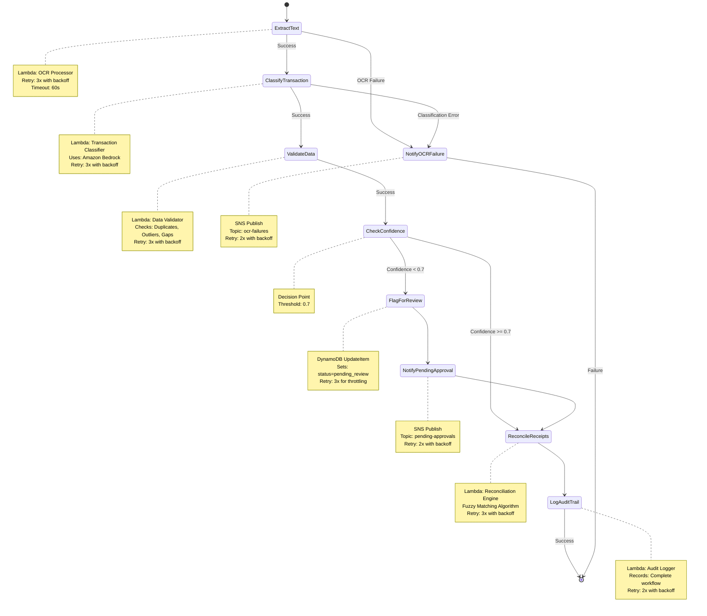

# Step Functions Workflow Diagram

## Visual Representation



## State Transition Details

### Happy Path (High Confidence)
1. **ExtractText** → Extracts text from document using Textract
2. **ClassifyTransaction** → Classifies using Bedrock (confidence: 0.92)
3. **ValidateData** → Validates for duplicates/outliers
4. **CheckConfidence** → Evaluates confidence >= 0.7 ✓
5. **ReconcileReceipts** → Matches with bank transactions
6. **LogAuditTrail** → Records complete workflow
7. **End** → Success

### Review Path (Low Confidence)
1. **ExtractText** → Extracts text from document
2. **ClassifyTransaction** → Classifies using Bedrock (confidence: 0.55)
3. **ValidateData** → Validates for duplicates/outliers
4. **CheckConfidence** → Evaluates confidence < 0.7 ✓
5. **FlagForReview** → Updates DynamoDB status
6. **NotifyPendingApproval** → Sends SNS notification
7. **ReconcileReceipts** → Matches with bank transactions
8. **LogAuditTrail** → Records complete workflow
9. **End** → Success (pending human approval)

### Error Path (OCR Failure)
1. **ExtractText** → Textract fails (image quality issue)
2. **NotifyOCRFailure** → Sends SNS notification
3. **End** → Failure (requires manual entry)

## Retry Behavior

### Lambda Invocations
```
Attempt 1: Immediate
Attempt 2: Wait 2 seconds
Attempt 3: Wait 4 seconds
Attempt 4: Wait 8 seconds
```

### DynamoDB Operations
```
Attempt 1: Immediate
Attempt 2: Wait 1 second
Attempt 3: Wait 2 seconds
Attempt 4: Wait 4 seconds
```

### SNS Notifications
```
Attempt 1: Immediate
Attempt 2: Wait 2 seconds
Attempt 3: Wait 4 seconds
```

## Data Flow

### Input (Workflow Start)
```json
{
  "document_id": "doc_abc123",
  "s3_bucket": "accounting-copilot-documents",
  "s3_key": "documents/user123/receipts/2024/01/doc_abc123.jpg",
  "user_id": "user123"
}
```

### After ExtractText
```json
{
  "document_id": "doc_abc123",
  "s3_bucket": "accounting-copilot-documents",
  "s3_key": "documents/user123/receipts/2024/01/doc_abc123.jpg",
  "user_id": "user123",
  "ocr_result": {
    "Payload": {
      "status": "success",
      "extracted_text": "Office Depot...",
      "parsed_fields": {
        "date": "2024-01-15",
        "amount": 45.99,
        "vendor": "Office Depot"
      }
    }
  }
}
```

### After ClassifyTransaction
```json
{
  "document_id": "doc_abc123",
  "user_id": "user123",
  "ocr_result": { "..." },
  "classification_result": {
    "Payload": {
      "transaction_id": "txn_xyz789",
      "category": "Office Supplies",
      "confidence": 0.92,
      "reasoning": "Vendor name indicates office supplies",
      "amount": 45.99,
      "date": "2024-01-15"
    }
  }
}
```

### After ValidateData
```json
{
  "document_id": "doc_abc123",
  "user_id": "user123",
  "ocr_result": { "..." },
  "classification_result": { "..." },
  "validation_result": {
    "Payload": {
      "is_duplicate": false,
      "is_outlier": false,
      "validation_issues": []
    }
  }
}
```

### Final Output (Success)
```json
{
  "document_id": "doc_abc123",
  "user_id": "user123",
  "ocr_result": { "..." },
  "classification_result": { "..." },
  "validation_result": { "..." },
  "reconciliation_result": {
    "Payload": {
      "matched": true,
      "bank_transaction_id": "bank_txn_456",
      "match_confidence": 0.95
    }
  },
  "audit_result": {
    "Payload": {
      "audit_id": "audit_001",
      "status": "logged"
    }
  }
}
```

## Error Scenarios

### Scenario 1: Textract Service Unavailable
- **State**: ExtractText
- **Error**: Lambda.ServiceException
- **Action**: Retry 3 times with exponential backoff
- **If Still Fails**: Route to NotifyOCRFailure

### Scenario 2: Poor Image Quality
- **State**: ExtractText
- **Error**: OCRFailure (custom error)
- **Action**: Immediately route to NotifyOCRFailure
- **No Retry**: Image quality won't improve with retries

### Scenario 3: Bedrock Rate Limiting
- **State**: ClassifyTransaction
- **Error**: Lambda.TooManyRequestsException
- **Action**: Retry 3 times with exponential backoff
- **Backoff**: Allows rate limit to reset

### Scenario 4: DynamoDB Throttling
- **State**: FlagForReview
- **Error**: DynamoDB.ProvisionedThroughputExceededException
- **Action**: Retry 3 times with exponential backoff
- **Backoff**: Allows capacity to become available

### Scenario 5: SNS Temporary Failure
- **State**: NotifyPendingApproval
- **Error**: SNS.ServiceException
- **Action**: Retry 2 times with exponential backoff
- **Note**: Workflow continues even if notification fails

## Performance Characteristics

### Expected Execution Times
- **ExtractText**: 3-5 seconds
- **ClassifyTransaction**: 1-2 seconds
- **ValidateData**: 0.5-1 second
- **CheckConfidence**: < 0.1 second
- **FlagForReview**: 0.2-0.5 second
- **NotifyPendingApproval**: 0.3-0.5 second
- **ReconcileReceipts**: 1-2 seconds
- **LogAuditTrail**: 0.3-0.5 second

### Total Workflow Duration
- **High Confidence Path**: 6-10 seconds
- **Low Confidence Path**: 7-11 seconds
- **Failure Path**: 3-5 seconds

### State Transition Count
- **High Confidence Path**: 6 transitions
- **Low Confidence Path**: 9 transitions
- **Failure Path**: 2 transitions

## Monitoring Queries

### CloudWatch Insights - Success Rate
```
fields @timestamp, @message
| filter @message like /ExecutionSucceeded/
| stats count() as successes by bin(5m)
```

### CloudWatch Insights - Average Duration
```
fields @timestamp, executionDuration
| filter @message like /ExecutionSucceeded/
| stats avg(executionDuration) as avg_duration by bin(1h)
```

### CloudWatch Insights - Error Analysis
```
fields @timestamp, error.Error, error.Cause
| filter @message like /ExecutionFailed/
| stats count() by error.Error
```

## Compliance and Audit

The workflow ensures:
- ✓ All AI decisions are logged (LogAuditTrail state)
- ✓ Low confidence transactions require human review (CheckConfidence)
- ✓ Failures are notified to users (NotifyOCRFailure, NotifyPendingApproval)
- ✓ Complete execution history retained in CloudWatch
- ✓ X-Ray tracing enabled for performance analysis
